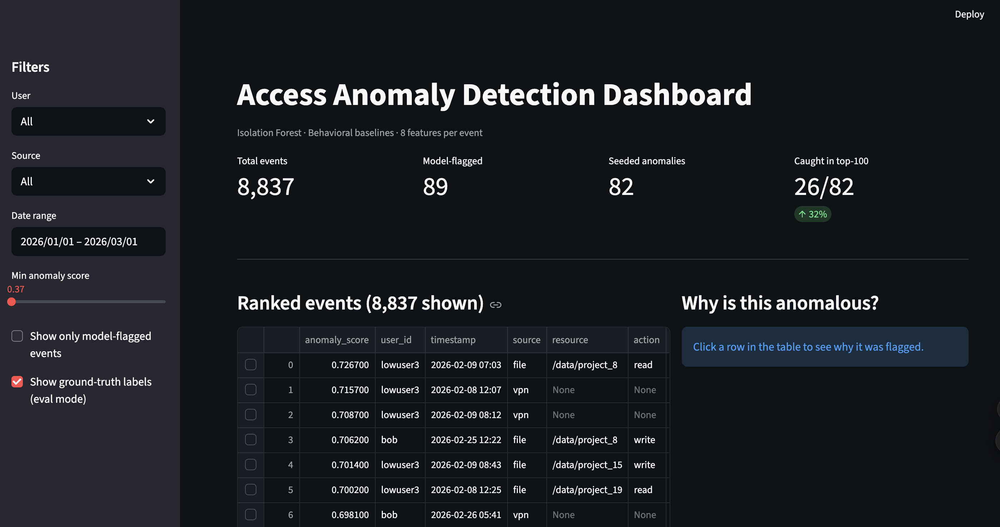

# Access Log Anomaly Detection

An end-to-end data engineering + ML system that ingests access logs from multiple sources, engineers per-user behavioral features, scores every event with an Isolation Forest, and surfaces the most suspicious events on an interactive dashboard.

```
Raw multi-source logs  →  normalize to unified schema  →  aggregate into
per-user behavioral features  →  Isolation Forest scores each event  →
dashboard ranks & visualizes the suspicious ones
```

---

## Why this project

Most anomaly detection uses global rules ("flag any login after midnight"). The problem: a night-shift admin logging in at 3am is normal for *them*. This system instead builds a **per-user behavioral baseline** and flags events that deviate from *that user's own history* — so the night admin stays clean while a 9-to-5 worker logging in at 3am gets flagged.

---

## Demo



---

## Architecture

| Stage | Module | What it does |
|-------|--------|-------------|
| 1. Synthetic data | `generate_logs.py` | Simulates 11 users × 60 days across 3 log sources with seeded labeled anomalies |
| 2. Normalization | `pipeline.py` | Reads 3 differently-shaped CSVs, normalizes to one unified schema |
| 3. Features | `features.py` | Builds per-user baselines; computes 8 behavioral features per event |
| 4. Detection | `detect.py` | Fits Isolation Forest; scores and ranks events; validates against seeded labels |
| 5. Dashboard | `app.py` | Streamlit UI with ranked table, filters, and per-event explanation panel |

---

## Setup

**Requirements:** Python 3.9+

```bash
git clone https://github.com/zamanshakil/access-anomaly-detection.git
cd access-anomaly-detection

python3 -m venv venv
source venv/bin/activate        # Windows: venv\Scripts\activate
pip install -r requirements.txt
```

## Run

```bash
python src/generate_logs.py     # writes data/raw/*.csv
python src/pipeline.py          # writes data/processed/events.parquet
python src/features.py          # writes data/processed/features.parquet
python src/detect.py            # writes data/processed/scored_events.parquet + prints validation
streamlit run src/app.py        # opens dashboard at http://localhost:8501
```

---

## Data sources (deliberately heterogeneous)

Three simulated log formats — different column names and timestamp formats — to create a realistic normalization problem:

| Source | User field | Timestamp format | Extra fields |
|--------|-----------|-----------------|-------------|
| VPN log | `user` | `YYYY-MM-DD HH:MM:SS` | `source_ip`, `country`, `session_minutes` |
| App auth log | `username` | `MM/DD/YYYY HH:MM:SS` | `app_name`, `status`, `role` |
| File access log | `userId` | `YYYYMMDDTHHMMSSz` | `resource_path`, `bytes_transferred`, `action` |

All three normalize into a unified schema: `event_id, user_id, timestamp, source, country, ip, resource, action, status, bytes, session_minutes`.

---

## Feature engineering

The 8 behavioral features — all computed **relative to each user's own baseline** using only data prior to the event (no leakage):

| Feature | Captures |
|---------|---------|
| `hour_deviation` | Z-score of login hour vs. user's historical hour distribution |
| `access_count_ratio` | Events in last 24h vs. user's rolling daily average |
| `distinct_resources_ratio` | Resources touched today vs. user's daily average |
| `bytes_ratio` | This event's bytes vs. user's mean bytes |
| `geo_change_score` | New country + impossible travel (0–2 score) |
| `failed_attempt_count` | Failed auth events in last 24h |
| `is_first_time_resource` | 1 if user has never touched this resource before |
| `is_rare_action` | How unusual this action is for this user (0–1) |

**Cold-start handling:** users with fewer than 5 prior events fall back to neutral feature values rather than generating false positives.

---

## Anomaly detection

**Algorithm: Isolation Forest** — chosen because:
- Unsupervised (no labeled breach data exists in reality)
- Handles multivariate anomalies that no single feature would catch
- Scales well and needs minimal tuning vs. clustering alternatives

`contamination=0.01` matches the seeded anomaly rate (~1%).

**Validation results** (seeded ground truth, never seen by the model):

| Pattern | Seeded | Caught in top-200 | Detection rate |
|---------|--------|-------------------|---------------|
| `priv_escalation` | 16 | 12 | 75% |
| `failed_storm` | 39 | 21 | 54% |
| `off_hours` | 6 | 1 | 17% |
| `volume_exfil` | 15 | 2 | 13% |
| `impossible_travel` | 6 | 0 | 0% |

Priv escalation and failed storms are easiest — they produce distinctive bursts. Off-hours and volume exfil are harder because a night admin is normal by design and data analysts genuinely move large files. Impossible travel needs more VPN history density to be distinctive.

---

## Dashboard

- **Ranked anomaly table** — top events by score, seeded anomalies highlighted
- **Sidebar filters** — by user, source, date range, score threshold, model-flagged only
- **"Why" panel** — click any event to see its feature values vs. the user's normal range, plus a plain-English summary
- **Score distribution** — histogram + anomaly type breakdown for the current filter

The explanation panel is designed as a clean seam: the template-based summaries are a drop-in replacement for an LLM call (v2).

---

## Design decisions

**Why not a threshold / z-score?** Single-variable rules miss multivariate weirdness. A user's bytes are normal, their hour is normal, their country is normal — but all three being slightly off at once is suspicious.

**Why not DBSCAN?** More parameter-sensitive, slower, and doesn't naturally produce a continuous anomaly score for ranking.

**Why synthetic data?** No real breach data is available, and generating it forces you to define what "anomalous" means — which is the feature engineering in disguise. Seeding known patterns lets you measure detection rate honestly.

**Why modular scripts instead of a notebook?** Each stage reads from disk and writes to disk, so they're independently runnable, debuggable, and replaceable. A notebook would couple everything.
